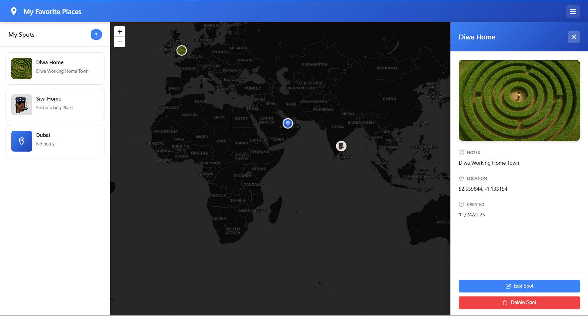

# My Favorite Places 🗺️

A modern, offline-first web application for marking and saving your favorite locations on an interactive map. No backend, no database servers, no signup required - everything runs locally in your browser with a beautiful, professional interface.



*Screenshot showing the modern interface with sidebar, photo markers, and basemap selector*

## ✨ Features

### Core Functionality
- 📍 **Click-to-Add**: Click anywhere on the map to create a spot
- 📝 **Rich Details**: Add title, photo, and notes to each location
- 💾 **Local Storage**: All data stored in your browser (IndexedDB)
- 🔒 **Complete Privacy**: No data leaves your device
- 🌐 **Offline-First**: Works without internet after initial load
- 📱 **Fully Responsive**: Beautiful on mobile and desktop

### Modern Interface
- 🎨 **Professional Design**: Modern gradient header and clean UI
- 🖼️ **Photo Markers**: Your photos appear directly on the map
- 📋 **Side Panel**: Browse all your spots in an elegant sidebar
- 🎯 **Smart Navigation**: Click once to fly to location, twice to see details
- 🗑️ **Quick Delete**: Delete button on each spot card
- 🌓 **Multiple Basemaps**: Choose from 4 different map styles

### Interactive Features
- **Zoom-Responsive Markers**: Markers resize based on zoom level
- **Two-Click Behavior**: First click flies to location, second opens details
- **Right-Side Details Panel**: Elegant panel with full spot information
- **Basemap Selector**: Switch between Streets, Satellite, Terrain, and Dark mode
- **Custom Cursors**: Crosshair on map, pointer on interactive elements

## 🚀 Quick Start

### Option 1: Direct File Access (Simplest)

1. Download or clone this repository
2. Open `index.html` directly in your web browser
3. Start marking your favorite places!

### Option 2: Local Web Server (Recommended)

```bash
# Using Python 3
python -m http.server 8000

# Using Node.js
npx http-server

# Using PHP
php -S localhost:8000
```

Then open `http://localhost:8000` in your browser.

## 📖 How to Use

### Adding a Spot
1. **Click on the map** where you want to add a spot
2. **Fill in the form**:
   - Title (required)
   - Photo (optional, max 5MB)
   - Notes (optional)
3. **Click "Save"**
4. Your spot appears on the map and in the sidebar!

### Viewing Spots
- **From Sidebar**: Click a spot card once to fly there, twice to see details
- **From Map**: Click any marker to open the details panel
- **Details Panel**: Slides in from the right with full information

### Managing Spots
- **Edit**: Click "Edit Spot" button in the details panel
- **Delete**: 
  - Quick delete: Hover over spot card and click the X button
  - Or click "Delete Spot" in the details panel
- **Navigate**: Click spot cards to fly to their location on the map

### Changing Map Style
Click the basemap selector buttons in the top-right corner:
- 🏙️ **Streets**: Standard map with street names
- 🛰️ **Satellite**: High-resolution satellite imagery
- ⛰️ **Terrain**: Topographic map with elevation
- 🌙 **Dark**: Modern dark theme

## 🎨 User Interface

### Header
- **Gradient Design**: Modern blue gradient with location pin icon
- **App Title**: "My Favorite Places"
- **Sidebar Toggle**: Menu button to show/hide the sidebar

### Sidebar
- **Spot Counter**: Shows total number of saved spots
- **Spot Cards**: Each card displays:
  - Photo thumbnail or gradient icon
  - Title and notes preview
  - Quick delete button (X) on hover
- **Empty State**: Helpful message when no spots exist

### Map
- **Crosshair Cursor**: Indicates you can click to add a spot
- **Photo Markers**: Your photos appear as circular markers
- **Icon Markers**: Beautiful gradient icons for spots without photos
- **Zoom-Responsive**: Markers resize from 30px to 70px based on zoom
- **Basemap Selector**: Floating control in top-right corner

### Details Panel
- **Slides from Right**: Elegant animation
- **Gradient Header**: With spot title and close button
- **Photo Display**: Large, beautiful photo preview
- **Information Sections**: Notes, location, and creation date with icons
- **Action Buttons**: Edit and Delete with icons

## 🛠️ Technical Details

### Technology Stack
- **HTML5**: Semantic markup with custom favicon
- **CSS3**: Modern styling with gradients, shadows, and animations
- **Vanilla JavaScript (ES6+)**: No frameworks, pure JavaScript
- **IndexedDB**: Robust local database for data persistence
- **Leaflet.js 1.9.4**: Open-source mapping library (MIT License)

### Map Providers
- **OpenStreetMap**: Default street map
- **Esri World Imagery**: Satellite view
- **OpenTopoMap**: Terrain with elevation
- **CartoDB Dark**: Dark mode theme

### Data Storage
All data is stored locally in your browser using IndexedDB:
- Spots with metadata (title, notes, coordinates, timestamps)
- Photos as base64-encoded strings (max 5MB per photo)
- No external servers or cloud storage
- Automatic ID generation for each spot

### File Structure
```
my-favorite-places/
├── index.html              # Main application page
├── css/
│   └── styles.css          # Complete styling with animations
├── js/
│   ├── app.js              # Application initialization
│   ├── map.js              # Map & basemap management
│   ├── storage.js          # IndexedDB operations
│   ├── spots.js            # Spot CRUD operations
│   └── ui.js               # UI components & interactions
├── lib/
│   └── leaflet/            # Leaflet.js library files
│       ├── leaflet.js
│       ├── leaflet.css
│       ├── marker-icon.png
│       └── marker-shadow.png
├── README.md               # This file
└── requirements.md         # Detailed requirements
```

## 🔒 Privacy & Security

- **100% Local**: All data stays on your device
- **No Tracking**: No analytics, cookies, or external requests
- **No Account**: No signup, login, or authentication required
- **Your Control**: Data can be cleared anytime via browser settings
- **Offline-First**: Works without internet after initial page load

## ⚙️ Browser Compatibility

Tested and working on:
- ✅ Chrome/Edge 90+
- ✅ Firefox 88+
- ✅ Safari 14+

Required browser features:
- IndexedDB support
- ES6+ JavaScript
- CSS Grid/Flexbox
- FileReader API

## 📏 Limitations

- Photos limited to 5MB each
- Data tied to browser (clearing browser data removes spots)
- No sync between devices or browsers
- No built-in backup/restore (can be added)
- Map tiles require internet on first load

## 🚀 Future Enhancements

Potential features for future versions:
- 📤 Export/import spots as JSON
- 🔍 Search and filter spots by title or notes
- 🏷️ Categories and tags for organization
- 📸 Multiple photos per spot
- 🛣️ Route drawing between spots
- 📊 Statistics and insights
- 🌐 PWA support for true offline capability
- ☁️ Optional cloud sync

## 📄 License

MIT License - Feel free to use, modify, and distribute.

## 🙏 Credits

- Maps powered by [Leaflet.js](https://leafletjs.com/)
- Map tiles from:
  - [OpenStreetMap](https://www.openstreetmap.org/)
  - [Esri](https://www.esri.com/)
  - [OpenTopoMap](https://opentopomap.org/)
  - [CartoDB](https://carto.com/)

## 🐛 Troubleshooting

### Map not loading?
- Check your internet connection (needed for initial tile download)
- Ensure JavaScript is enabled in your browser
- Try refreshing the page
- Try a different browser

### Spots not saving?
- Check if browser storage is full
- Ensure IndexedDB is enabled in browser settings
- Try clearing browser cache and reloading
- Check browser console for errors

### Photos not uploading?
- Verify file size is under 5MB
- Use supported formats: JPEG, PNG, GIF, WebP
- Try a smaller or different photo
- Check browser console for errors

### Basemap not switching?
- Ensure you have internet connection
- Try refreshing the page
- Check browser console for tile loading errors

### Details panel not showing?
- Click the spot card twice (first click flies to location)
- Or click directly on a marker on the map
- Check if panel is hidden behind other elements

## 💡 Tips & Tricks

- **Quick Delete**: Hover over spot cards in sidebar to see delete button
- **Fly to Location**: Single click on spot card flies to that location
- **Zoom for Details**: Zoom in close before clicking marker for better view
- **Photo Markers**: Add photos to see them directly on the map
- **Keyboard Navigation**: Use Tab to navigate through interactive elements
- **Mobile Friendly**: Works great on phones and tablets

---

**Made with ❤️ for offline-first web applications**

*Version 2.0 - Now with modern UI, photo markers, and multiple basemaps!*
